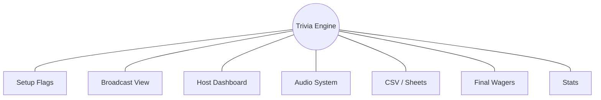

<div align="center">

# Trivia Broadcast Engine

Professional dual-screen trivia hosting with a broadcast view, host dashboard, helper controls, custom media, and scriptable setup flags.

[](LICENSE)
[](https://nodejs.org/)
[](https://socket.io/)
[](https://expressjs.com/)
[](https://github.com/L-Logix/Trivia-Board/stargazers)
[](https://github.com/L-Logix/Trivia-Board/issues)

</div>

## What It Does

Trivia Broadcast Engine runs a live-hosted trivia game on your local network. The audience sees a full-screen broadcast board, while the host controls clue selection, reveals, scores, wagers, audio, and game flow from a dashboard.

| View | URL | Purpose |
| --- | --- | --- |
| Broadcast | `/broadcast` | Audience-facing display for a TV, projector, or capture card |
| Dashboard | `/dashboard` | Main host controls for the whole game |
| Scoring Helper | `/helper-scoring` | Secondary scoring controls |
| Board Helper | `/helper-board` | Secondary board controls |
| Editor | `/editor` | In-browser content and settings editor |
| Stats | `/stats` | Post-game charts and printable reports |

## Star Graph



| Area | Rating |
| --- | --- |
| Live hosting flow | ***** |
| Scriptable setup | ***** |
| Custom audio and visuals | ***** |
| Google Sheets / CSV imports | ***** |
| Helper-device support | **** |
| Post-game reporting | **** |

## Quick Start

Requires Node.js 18+.

```bash
git clone https://github.com/L-Logix/Trivia-Board.git
cd Trivia-Board
npm install
npm run setup
npm start
```

The server opens on port `3333`. Use `http://localhost:3333` on the host machine, or the LAN address printed in the terminal for another device.

## Game Flow

1. Open `/broadcast` on the audience screen and click once to unlock browser audio.
2. Open `/dashboard` on the host laptop.
3. Start the intro, reveal categories, populate the board, and select clues.
4. Use the dashboard to mark correct/incorrect answers and control the timer.
5. Bonus clues use wagers.
6. Final/championship only asks the host for wagers. The host does not enter contestant answers.

## Setup Wizard

```bash
trivia setup
```

The wizard configures board size, values, bonus clues, timer duration, CSV or Google Sheets content, players, labels, and media files.

If the global `trivia` command fails with `node.exe is not recognized`, Node is not on your PATH. Install Node.js 18+, reopen PowerShell, then reinstall or relink the package with `npm install -g .` from this folder.

## Flag Examples

Refresh your saved sheets without walking through the wizard:

```bash
trivia setup --update-content
```

Load specific sheets and use modern values:

```bash
trivia setup --modern --round1 round1.csv --round2 round2.csv --championship final.csv
```

Update only players, labels, and intro video music:

```bash
trivia setup --players "Alice,Bob,Charlie" --bonus-label "DAILY DOUBLE" --video-music intro-theme.mp3
```

Update exact bonus clue positions. Positions are 1-based as `column:row`.

```bash
trivia setup --bonus-positions-r1 3:5 --bonus-positions-r2 2:3,1:4
```

Set any config value directly:

```bash
trivia setup --set "labels.bonusClue=DAILY DOUBLE" --set timerSeconds=8
```

## Full Flag Reference

### Content

| Flag | Meaning |
| --- | --- |
| `--content`, `--update-content` | Refresh from saved sources or sources passed in this command |
| `--round1 PATH_OR_URL`, `--r1 PATH_OR_URL` | Round 1 CSV file or published Google Sheets CSV URL |
| `--round2 PATH_OR_URL`, `--r2 PATH_OR_URL` | Round 2 CSV file or published Google Sheets CSV URL |
| `--round2-same-as-round1` | Build Round 2 from the Round 1 source using double values |
| `--championship PATH_OR_URL`, `--final PATH_OR_URL` | Final/championship CSV file or URL |
| `--players "A,B,C"` | Replace player names |
| `--no-save-sources` | Do not remember the passed sheet/file sources |

### Presets And Values

| Flag | Meaning |
| --- | --- |
| `--modern` | Use `200,400,600,800,1000` and `400,800,1200,1600,2000` |
| `--traditional` | Use `100,200,300,400,500` and `200,400,600,800,1000` |
| `--values LIST` | Round 1 values, for example `200,400,600,800,1000` |
| `--double-values LIST` | Round 2 values |

### Game Settings

| Flag | Meaning |
| --- | --- |
| `--columns N` | Board column count |
| `--rows N` | Board row count |
| `--timer N`, `--timer-seconds N` | Clue timer duration in seconds |
| `--double-round [true|false]` | Enable or disable Round 2 |
| `--single-round`, `--no-double-round` | Disable Round 2 |
| `--bonus-r1 N`, `--bonus-clues-r1 N` | Number of Round 1 bonus clues |
| `--bonus-r2 N`, `--bonus-clues-r2 N` | Number of Round 2 bonus clues |
| `--bonus-positions-r1 LIST` | Round 1 bonus positions, for example `3:5,6:5` |
| `--bonus-positions-r2 LIST` | Round 2 bonus positions, for example `2:3,1:4` |
| `--bonus-method TEXT` | Bonus clue assignment method label stored in config |
| `--child-host [true|false]`, `--kid-mode [true|false]` | Toggle child-host mode |
| `--no-child-host`, `--no-kid-mode` | Disable child-host mode |
| `--jeopardy-style [true|false]` | Toggle Jeopardy-style labels |
| `--no-jeopardy-style` | Disable Jeopardy-style labels |

### Labels

| Flag | Meaning |
| --- | --- |
| `--bonus-label TEXT` | Label for bonus clues |
| `--championship-label TEXT`, `--final-label TEXT` | Header label for Final/championship |
| `--championship-section TEXT`, `--final-section TEXT` | Section label for Final/championship |
| `--round2-suffix TEXT` | Round 2 suffix label |

### Assets

Asset flags copy your file into the correct `public/` folder and update `config.json`.

| Flag | Destination |
| --- | --- |
| `--logo PATH` | `public/img/logo.*` |
| `--category-cover PATH`, `--price-cover PATH` | `public/img/cat-cover.*` |
| `--intro-video PATH` | `public/video/intro.mp4` |
| `--intro-audio PATH`, `--intro-music PATH`, `--video-music PATH` | `public/audio/intro-audio.mp3` |
| `--bonus-image PATH`, `--bonus-clue-image PATH` | `public/img/bonus-clue.*` |
| `--promo-image PATH` | `public/img/promo.*` |
| `--host-intro PATH` | `public/audio/host-intro.mp3` |
| `--times-up PATH` | `public/audio/times-up.mp3` |
| `--bonus-sound PATH`, `--bonus-clue-sound PATH` | `public/audio/daily-double.mp3` |
| `--think-music PATH`, `--final-think PATH` | `public/audio/final-think.mp3` |
| `--applause PATH` | `public/audio/applause.mp3` |
| `--board-fill PATH` | `public/audio/board-fill.mp3` |
| `--correct-sound PATH` | `public/audio/correct.mp3` |
| `--incorrect-sound PATH` | `public/audio/incorrect.mp3` |
| `--outro PATH` | `public/audio/outro.mp3` |
| `--background-music PATH`, `--bg-music PATH` | `public/audio/background.mp3` |

Generic asset controls:

| Flag | Meaning |
| --- | --- |
| `--asset key=PATH` | Update any asset by key |
| `--enable-asset KEY` | Mark an existing asset enabled |
| `--disable-asset KEY`, `--no-asset KEY` | Mark an asset disabled |

Asset keys are `logo`, `categoryCover`, `introVideo`, `introAudio`, `bonusClueImage`, `promoImage`, `hostIntro`, `timesUp`, `bonusClue`, `championshipThink`, `applause`, `boardFill`, `correct`, `incorrect`, `outro`, and `backgroundMusic`.

### Escape Hatch

| Flag | Meaning |
| --- | --- |
| `--set path=value` | Set any `config.json` field, including nested paths |

Use quotes when the value contains spaces:

```bash
trivia setup --set "labels.championshipHdr=FINAL JEOPARDY"
```

JSON arrays and objects are accepted:

```bash
trivia setup --set "baseValues=[200,400,600,800,1000]"
```

## CSV Format

Simple CSV format:

| Category | Clue | Answer | Value |
| --- | --- | --- | --- |
| History | This president was born in 1732 | Who is George Washington? | 200 |
| Science | H2O is the chemical formula for this | What is water? | 400 |

Rules:

- Row 1 should be `Category,Clue,Answer,Value`.
- `Value` is optional but recommended.
- Clues are grouped by category and sorted into rows by value when values are present.
- Published Google Sheets CSV URLs work anywhere a CSV path works.

Final/championship CSV uses:

```csv
Category,Clue,Answer
Famous Homes,This estate stored National Gallery art during World War II,What is the Biltmore?
```

## Verification

Run the focused audio/done-reading verifier:

```bash
npm run verify:done-reading
```

Run the full stress suite:

```bash
npm run stress
```

The stress suite covers duplicate `done-reading` events, timer stability, answer scoring, bonus wagers, Final wager-only behavior, reset behavior, invalid inputs, broadcast audio playback, and setup flags.

## Project Layout

```text
bin/
  trivia.js
src/
  cli/
    setup.js
    start.js
  server/
    game-state.js
    socket-handlers.js
public/
  broadcast.html
  dashboard.html
  editor.html
  stats.html
  helper-board.html
  helper-scoring.html
  js/
  css/
  audio/
  img/
  video/
scripts/
  stress-test.js
  verify-done-reading-audio.js
```

## Development

```bash
npm install
npm run setup
npm start
npm run stress
```

See [CONTRIBUTING.md](CONTRIBUTING.md), [CODE_OF_CONDUCT.md](CODE_OF_CONDUCT.md), and [SECURITY.md](SECURITY.md) for project process and reporting.
